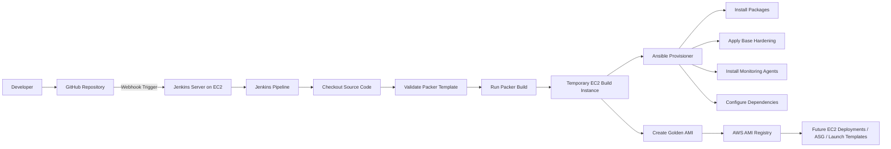

# Golden-AMI-Pipeline-using-Packer


## Project Overview

This project demonstrates an automated Golden AMI creation pipeline using Jenkins, Packer, Ansible, and AWS EC2.

The objective of the project is to automate the creation of reusable, secure, and standardized Amazon Machine Images (AMIs) that can be used across environments for consistent infrastructure deployments.

Instead of manually configuring EC2 instances, Jenkins triggers an automated Packer build process whenever changes are pushed to GitHub. Packer launches a temporary EC2 build instance and uses Ansible to provision and configure the server before creating the Golden AMI.

---

# Architecture



---

# Architecture Explanation

The workflow begins when a developer pushes code changes to the GitHub repository.

A GitHub webhook triggers Jenkins, which is hosted on an AWS EC2 instance. Jenkins pulls the latest code from the repository and executes the CI/CD pipeline defined in the Jenkinsfile.

The pipeline validates the Packer template and initiates the AMI build process.

Packer launches a temporary EC2 instance using a base Amazon Linux image. During provisioning, Ansible playbooks are executed to install required packages, configure services, apply baseline hardening, install monitoring or security agents, and perform additional system configuration.

After provisioning is completed successfully, Packer creates a Golden AMI from the configured EC2 instance.

The temporary EC2 build instance is automatically terminated, and the newly created AMI becomes available for future infrastructure deployments.

---

# Tools Used

| Tool              | Purpose                                     |
| ----------------- | ------------------------------------------- |
| GitHub            | Source code management                      |
| Jenkins           | CI/CD automation                            |
| Packer            | Automated AMI creation                      |
| Ansible           | Configuration management and provisioning   |
| AWS EC2           | Jenkins server and temporary build instance |
| IAM Role          | Secure AWS authentication                   |
| Amazon Linux 2023 | Base operating system                       |

---

# Project Features

* Automated Golden AMI creation pipeline
* Jenkins-based CI/CD workflow
* GitHub webhook integration
* Infrastructure image automation using Packer
* Configuration management using Ansible
* Automated package installation and server configuration
* Baseline OS hardening during AMI creation
* IAM role-based AWS authentication without storing AWS credentials in Jenkins
* Reusable AMIs for future EC2 deployments
* Temporary build instances automatically terminated after AMI creation

---

# Repository Structure

```text
Golden-AMI-Pipeline-using-Packer/
│
├── Jenkinsfile
│
├── packer/
│   └── golden-ami.pkr.hcl
│
├── ansible/
│   ├── playbook.yml
│   ├── inventory.ini
│   └── roles/
│
├── userdata/
│   └── jenkins-userdata.sh
│
├── diagrams/
│   └── architecture.png
│
└── README.md
```

---

# Pipeline Workflow

1. Developer pushes code to GitHub.
2. GitHub webhook triggers Jenkins.
3. Jenkins checks out the latest repository code.
4. Jenkins validates the Packer template.
5. Jenkins runs the Packer build.
6. Packer launches a temporary EC2 build instance.
7. Ansible provisions and configures the instance.
8. Packer creates the Golden AMI.
9. Temporary EC2 instance is terminated.
10. AMI becomes available for future deployments.

---

# Jenkins Pipeline Example

```groovy
pipeline {
    agent any

    stages {
        stage('Checkout') {
            steps {
                git branch: 'main',
                url: 'https://github.com/your-username/Golden-AMI-Pipeline-using-Packer.git'
            }
        }

        stage('Packer Init') {
            steps {
                sh 'packer init packer/'
            }
        }

        stage('Packer Validate') {
            steps {
                sh 'packer validate packer/golden-ami.pkr.hcl'
            }
        }

        stage('Build Golden AMI') {
            steps {
                sh 'packer build packer/golden-ami.pkr.hcl'
            }
        }
    }
}
```

---

# Example Packer Ansible Provisioner

```hcl
build {
  sources = ["source.amazon-ebs.amazon-linux"]

  provisioner "ansible" {
    playbook_file = "ansible/playbook.yml"
  }
}
```

---

# AWS Setup

The Jenkins EC2 instance uses an IAM role for secure authentication to AWS services.

The IAM role should allow:

* EC2 instance management
* AMI creation
* Snapshot creation
* Describe EC2 resources
* Temporary resource cleanup

For lab environments, broader permissions such as AmazonEC2FullAccess may be acceptable. In production environments, least-privilege IAM policies should be implemented.

---

# Security Considerations

* No hardcoded AWS credentials inside Jenkins
* IAM instance profile attached to Jenkins EC2
* Automated and repeatable server configuration
* Standardized infrastructure images
* Reduced configuration drift
* Temporary EC2 build instances terminated after AMI creation
* Improved auditability and compliance consistency

---

# Why Use Golden AMIs?

Golden AMIs provide organizations with pre-configured, tested, and standardized machine images.

Benefits include:

* Faster infrastructure provisioning
* Consistent server configurations
* Reduced manual setup effort
* Improved security posture
* Easier scaling and recovery
* Better operational consistency
* Reduced configuration drift across environments

---

# Future Improvements

* Integrate AWS Inspector for vulnerability scanning
* Add Trivy security scanning
* Add AMI lifecycle management
* Integrate Slack or email notifications
* Deploy EC2 instances using Terraform and latest AMI IDs
* Add automated testing and validation stages
* Add approval workflow before production AMI release
* Integrate CloudWatch monitoring agents during provisioning

---

# Project Outcome

This project demonstrates practical DevOps and Cloud Engineering skills including:

* CI/CD pipeline implementation
* Infrastructure automation
* Automated AMI creation
* Configuration management using Ansible
* Jenkins pipeline orchestration
* AWS infrastructure integration
* IAM-based secure authentication
* Immutable infrastructure concepts
* Infrastructure standardization and repeatability

The project reflects a real-world enterprise workflow for creating approved Golden AMIs that can be used for secure, scalable, and consistent cloud infrastructure deployments.


